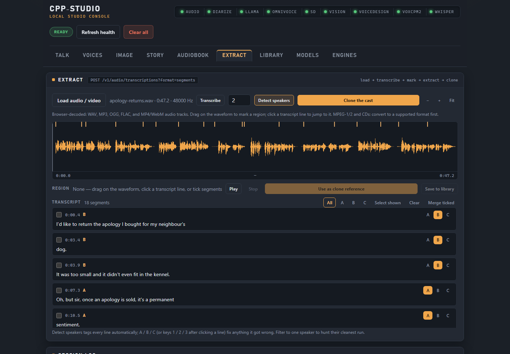
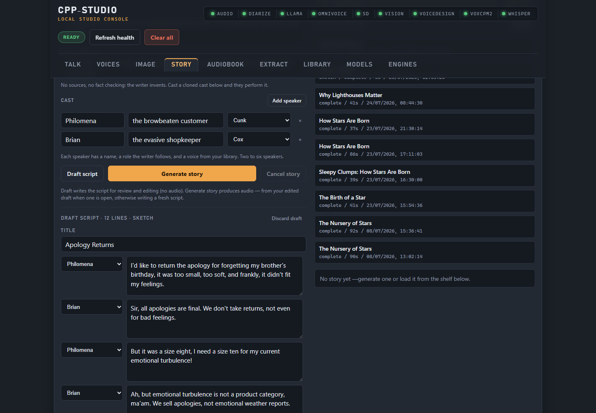
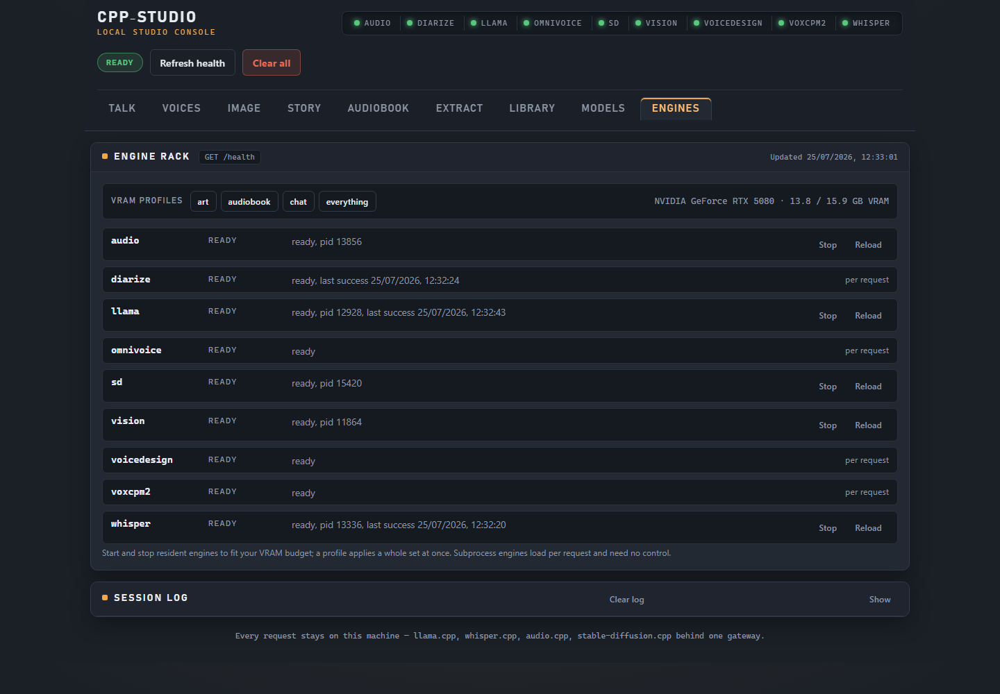

# cpp-studio

[](https://github.com/SleepyOldOrbs/cpp-studio/actions/workflows/ci.yml)

**A fully local, private, GPU-native AI studio.** Talk to it, clone and design
voices, mine voices out of any recording, narrate whole documents into
audiobooks, describe what it sees, and generate art — entirely offline on
your own machine. No cloud, no API keys, no telemetry. One Go gateway fronts
the native inference family —
[llama.cpp](https://github.com/ggml-org/llama.cpp),
[whisper.cpp](https://github.com/ggml-org/whisper.cpp),
[audio.cpp](https://github.com/0xShug0/audio.cpp),
[stable-diffusion.cpp](https://github.com/leejet/stable-diffusion.cpp), plus
audio.cpp Sortformer with [sherpa-onnx](https://github.com/k2-fsa/sherpa-onnx)
as its long-form/exact-speaker-count diarization fallback —
behind OpenAI-shaped HTTP routes and a browser studio console.



**The loop that makes it a studio:** drop in a recording, let whisper
transcribe it and diarization work out who spoke when, press **Clone the
cast** to mint a voice per speaker — then write something new and hear them
perform it. Everything above happened on one desktop GPU with no network
connection.

<table>
<tr>
<td width="50%">

[](docs/images/sketch-desk.png)

**Sketch mode.** Premise in, script out, performed by voices you cloned.
The same desk writes source-cited documentary in grounded mode.

</td>
<td width="50%">

[](docs/images/engine-rack.png)

**Your GPU, your rules.** Every engine has a power switch, and named VRAM
profiles trade resident models against your card's budget.

</td>
</tr>
</table>

## What it does

- **Talk** — a multi-turn voice loop: record or type, whisper transcribes,
  llama replies, TTS speaks the answer in ~1.5 s round trips. Live
  transcription re-transcribes your growing take as you speak — or go
  hands-free: the mic stays open, a pause ends each turn, and the reply
  speaks back before it listens again.
- **Voices** — clone a voice from 5–15 seconds of reference audio, or design
  one from a written description across three voice-design engines
  (VoxCPM2, OmniVoice, Qwen3 TTS), audition it, and keep it in a library.
- **Audiobook** — upload a `.txt`, `.md`, or `.epub`; it is chunked on
  sentence boundaries, narrated chunk by chunk in any library voice, and
  stitched into one WAV, with live progress and cancellation. The optional
  audio.cpp 0.5 DramaBox engine adds prompt-directed expressive delivery for
  factual books with no per-character/API fee; the existing fast narrator
  remains the default.
- **Story desk** — two modes, one desk. **Grounded**: paste sources, llama
  writes a fact-cited script for your cast, and no line ships that a source
  does not support. **Sketch**: give it a premise and a style instead, and
  the grounding comes off — the writer invents, and your cloned cast
  performs it. Either way every line is spoken and stitched into one piece.
- **The take room** — every produced line keeps its own recording, so one bad
  read does not cost you the episode. Retake a line, rewrite what it says,
  pick between takes, mute it, nudge the silence after it, then re-render.
  Renders are numbered revisions: what you already shared keeps playing what
  you shared. Point it at your own `ffmpeg` and every render is **mastered**
  — performers levelled against each other, the finished piece placed at
  -16 LUFS under a -1.5 dBTP ceiling, with the measured before and after
  written into the manifest and an honest `target_met: false` when the peak
  ceiling binds first. Any revision then exports to MP3 or Opus (that
  43-second two-hander: 2.0 MB WAV, 687 KB MP3, 348 KB Opus).
- **Transcribe** — a text-first desk for loaded files or microphone recordings.
  Correct speaker-tagged lines, rename a speaker throughout, search words or
  speakers, and download the edited result as TXT, Markdown, SRT, WebVTT, or
  JSON.
- **Extract** — a waveform-first sampler deck for voices. Filter to one
  speaker, mark a region or tick multiple lines, audition the result, save one
  stitched WAV, hand it to voice cloning with source/time/speaker provenance,
  or press **Clone the cast** to mint a library voice per speaker. A configured
  `yt-dlp` adds URL import. Transcribe and Extract share the same loaded audio,
  transcript, diarization, decode path, and
  `POST /v1/audio/transcriptions?format=segments` route, so switching tools
  does not reload or retranscribe the source.
- **Image lab** — Stable Diffusion generation (~2 s per 512×512 resident),
  plus true vision: a VLM describes any image and speaks the description.
- **Engine rack** — every engine has a power switch, and named VRAM profiles
  (chat / art / audiobook / everything) trade resident models against your
  card's budget with one click, with a live VRAM meter.
- **Library** — outputs you keep persist on disk with metadata; async work
  (stories, audiobooks) runs as cancellable jobs with progress.

## Requirements

- Windows (primary; the gateway and tests are cross-platform Go, the engine
  scripts and verified setup are Windows), Go 1.26+.
- An NVIDIA GPU for the full experience — the reference machine is an RTX
  5080 (16 GB). Engines also run on CPU builds, just slower.
- Native engine binaries and model weights are **not** bundled: you bring
  llama.cpp, whisper.cpp, audio.cpp, and stable-diffusion.cpp builds plus
  models (roughly 15 GB for the baseline; optional image and audio families can
  take the collection beyond 100 GB). `models.json` declares every
  model with its source; the Models tab keeps catalog, loader/package discovery,
  presence, checksum, configuration, health, and benchmark readiness distinct. The
  pinned DramaBox artifact can be installed only after an explicit immutable preview
  and short-lived confirmation; cpp-studio never silently downloads a model.

Engine programs live under `engines/`; model data lives separately under `models/`,
grouped by capability such as text, image, speech, transcription, music, and sound.
See [`docs/MODEL_LAYOUT.md`](docs/MODEL_LAYOUT.md) for the canonical tree.

## Quick start

```powershell
git clone https://github.com/SleepyOldOrbs/cpp-studio.git
cd cpp-studio
go test ./...
```

Prove the whole pipeline with zero native binaries — the fixture engine
fakes every engine deterministically:

```powershell
.\scripts\smoke-demo-ui.ps1
```

Then wire real engines: copy `config.example.json`, set the single `root`
var to where your engines and models live, and check it:

```powershell
go run .\cmd\cpp-studio --config .\my-config.json --check
go run .\cmd\cpp-studio --config .\my-config.json
```

Open the studio console at `http://127.0.0.1:8765/demo/`. Config vars,
engine modes, resident servers, VRAM profiles, and the bring-your-own-model
recipe are documented in [`docs/CONFIG.md`](docs/CONFIG.md).

## API

OpenAI-shaped where a shape exists, plain JSON where it doesn't. Highlights
(full reference in [`docs/API.md`](docs/API.md)):

| Route | What it does |
| --- | --- |
| `POST /v1/chat/completions` | proxy to the resident llama-server |
| `POST /v1/audio/transcriptions` | whisper transcription (resident or per-run) |
| `POST /v1/audio/speech` | TTS, default or any stored voice |
| `POST /v1/audio/conversions` | preserve a performance while changing its speaker identity |
| `POST /v1/voice` | the whole voice loop in one call |
| `POST /v1/voices` · `/v1/voices/design` | clone / design voices |
| `POST /v1/audio/transcriptions?format=segments` | timestamped transcript segments |
| `POST /v1/audio/diarization` | who-spoke-when clusters (CUDA Sortformer, sherpa fallback) |
| `POST /v1/audio/music` · `/v1/audio/music/analyze` | ACE-Step music creation, editing, and source analysis |
| `POST /v1/audio/import` | fetch a URL's audio through your own yt-dlp |
| `POST /v1/audio/decode` | convert what the browser can't read, via your own ffmpeg |
| `POST /v1/stories/{id}/export` | encode a render revision to MP3/Opus via your own ffmpeg |
| `POST /v1/images/generations` | Stable Diffusion, resident sd-server |
| `POST /v1/images/descriptions` | VLM describes an image, spoken aloud |
| `POST /v1/stories` | multi-voice story jobs, grounded or sketch |
| `POST /v1/audiobooks` | document → single-narrator audiobook job |
| `POST /v1/audiobooks/{id}/{resume,restart,discard}` | recover or explicitly remove interrupted audiobook work |
| `GET /v1/jobs` · `POST /v1/jobs/{id}/cancel` | every async job, one surface |
| `GET /v1/library` | persistent saved outputs |
| `POST /v1/engines/{name}/{start,stop,reload}` · `/v1/engines/profiles/{name}` | engine power + VRAM profiles |
| `GET /health` · `GET /v1/models/catalog` · `GET /v1/gpu` | health, model states, VRAM |

### Optional local music generation

The Music desk uses audio.cpp's ACE-Step 1.5 family for prompt-to-music,
lyrics, completion, covers, layer/stem operations, repainting, and source
analysis. The tracked first option is the 6,185,460,032-byte Turbo Q8_0 GGUF at
a pinned upstream revision and checksum. Install it from Models through the
same preview and short-lived confirmation used by other optional models; CPP
Studio never starts a model download from the tool itself. audio.cpp describes
the Q8 conversion as usable with possible output drift, so audition important
renders rather than treating quantization as transparent. The configured
`ace_step.mem_saver=true` releases staged graphs between requests to reduce
resident VRAM at the cost of possible rebuild time.

### Optional expressive factual audiobooks

DramaBox is an experimental English model from audio.cpp `release-0.5`. It
can act a factual passage from a short performance direction, with an
optional stored voice reference. To add it, review the upstream LTX-2
Community License and model card, then use the Models tab's explicit preview and
short-lived confirmation for the pinned `dramabox-q8-0` artifact (or download that
exact revision manually from
[`audio-cpp/audio.cpp-gguf`](https://huggingface.co/audio-cpp/audio.cpp-gguf/tree/96367c9cb9d7484206d629ba92a8745af03499c6/DramaBox-GGUF)). Copy
`config.dramabox-local.example.json` and edit its one `root` value.
The paired `dramabox-server.example.json` deliberately starts on CPU and
lazy-loads the model: the 18,942,803,808-byte file is larger than the
reference RTX 5080's 16,303 MiB VRAM. Measured Ryzen 7 9800X3D paragraph synthesis
is overnight-class (warm RTF 27.11 resident and 25.21 with memory saving). The
required native long-form case exhausted the 61.6 GiB qualification machine in both
profiles, so this CPU is not qualified for complete books. DramaBox CUDA fit remains
unverified because the model is larger than the reference GPU's VRAM; the release-0.5
CUDA runtime itself is qualified with the smaller configured Qwen TTS model. Keep the fast local
narrator for normal use. Local generation avoids a hosted usage bill, but storage,
compute, electricity, and licence obligations still exist.

DramaBox books are durable from the moment an ID is returned: canonical source,
resolved engine/voice/options, every section range, and every random seed are stored
before synthesis starts. Cancellation, a native-engine failure, or a cpp-studio
restart retains completed sections. Resume is identity-strict; Restart preserves the
old work and creates a new production under current configuration; only Discard
deletes a WIP. A configured Whisper engine enables optional per-section factual
comparison (`auto`, `required`, or `off`) with raw transcripts and visible warnings.
It is evidence, not a replacement for listening. See
[`docs/DRAMABOX_AUDIOBOOKS.md`](docs/DRAMABOX_AUDIOBOOKS.md).

## Verification

```powershell
.\scripts\verify.ps1
```

gofmt, `go test ./...`, vet, config checks, and the deterministic
browser-demo smoke (voice loop, cloning, design, image, durable audiobook, story) in one call.
Individual fixture smokes: `smoke-voice-loop-fixture.ps1`,
`smoke-story-fixture.ps1`, `smoke-demo-ui.ps1`. Measured local-engine
latencies and policies: [`docs/LOCAL_ENGINE_PROFILE.md`](docs/LOCAL_ENGINE_PROFILE.md).

The Story Builder interaction gate uses a real isolated browser and requires
Node.js with `npx` available. It covers the explicit main-Studio launch,
keyboard focus and shortcuts, the complete save/build/render/export/Library
round trip, and the focused timeline regressions:

```powershell
.\scripts\smoke-story-builder-browser.ps1
```

Release packaging (`dist/`, no weights bundled): `.\scripts\package-release.ps1`
— see [`docs/RELEASE.md`](docs/RELEASE.md).

## A note on cloning voices

The voice tools can reproduce a real person's voice from a few seconds of
audio. That power is the point — and it comes with an obvious
responsibility: **clone only voices you have the right to use** (your own,
voices with the speaker's consent, or material whose licence permits it),
and never present synthetic speech as a real person's words. Everything
runs locally; what you make and how you use it is on you.

The optional URL importer makes that easier to forget, so it says it twice:
you supply your own `yt-dlp` binary and configure it deliberately, and
whether a given URL is yours to download — and whose voice is in it — is
your call before you paste it, not the studio's after.

## Architecture in one paragraph

The gateway loads one JSON config describing engines as either resident
servers (started, health-checked, and proxied — llama, whisper, TTS, SD) or
per-request subprocesses (voice design). A lifecycle manager owns every
process; an engine-invocation seam owns CLI contracts, temp files, and
validation; GPU-heavy runs are serialized so they never race for VRAM.
Async pipelines (stories, audiobooks) register with a job registry and
persist artifacts to on-disk stores. The console is vanilla JS embedded in
the binary — rebuild to change it. Design notes live in
[`docs/ROADMAP.md`](docs/ROADMAP.md) and [`CONTEXT.md`](CONTEXT.md).
