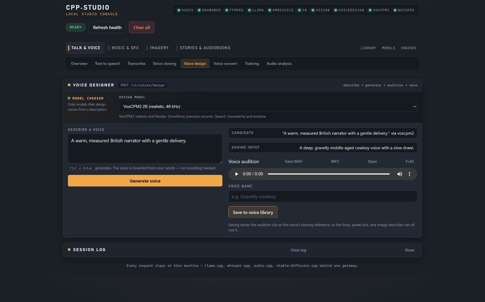
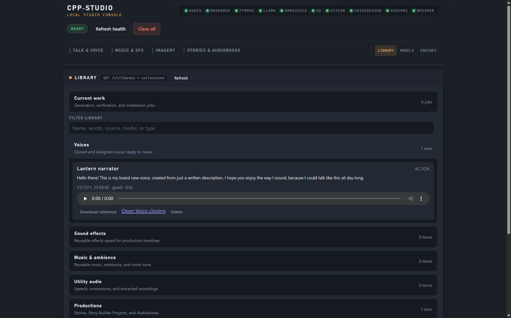
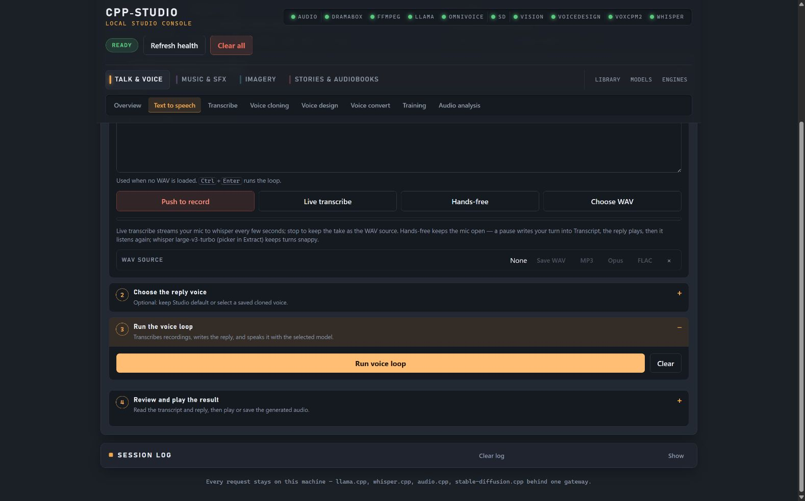
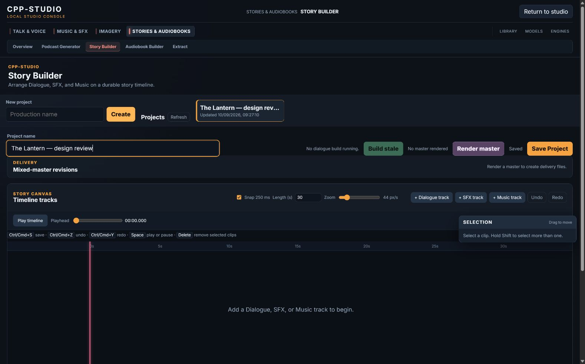
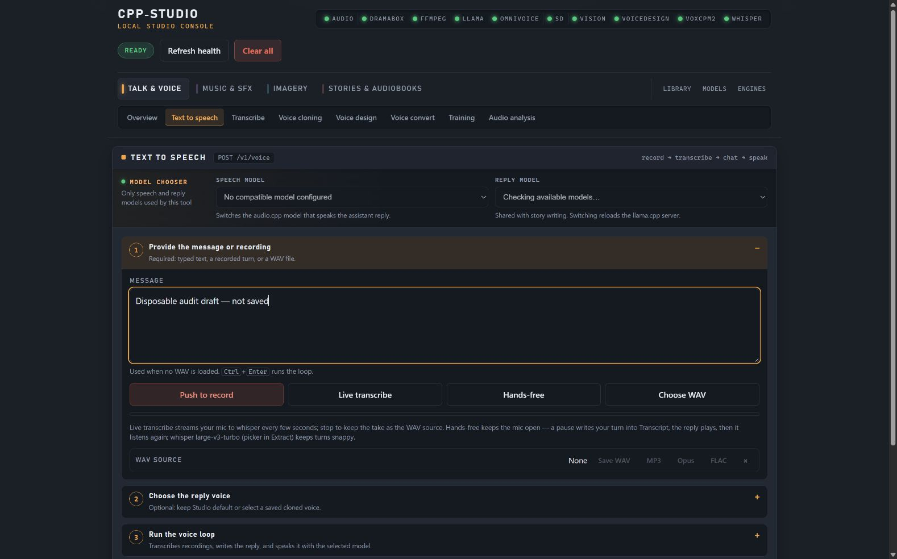
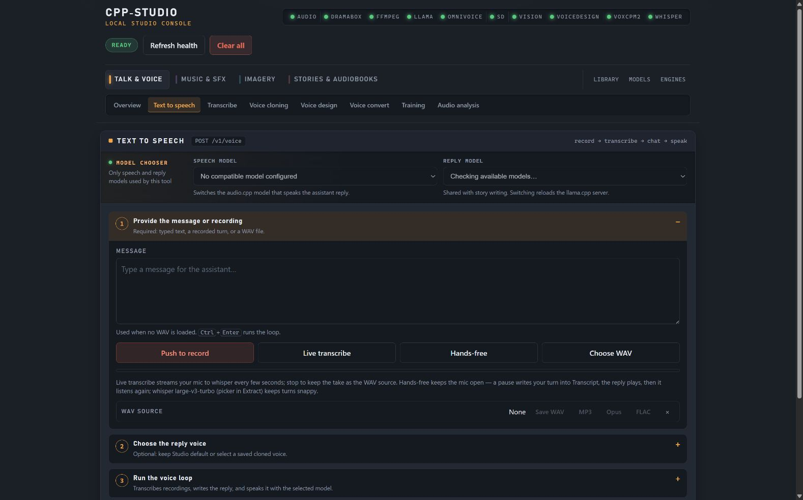
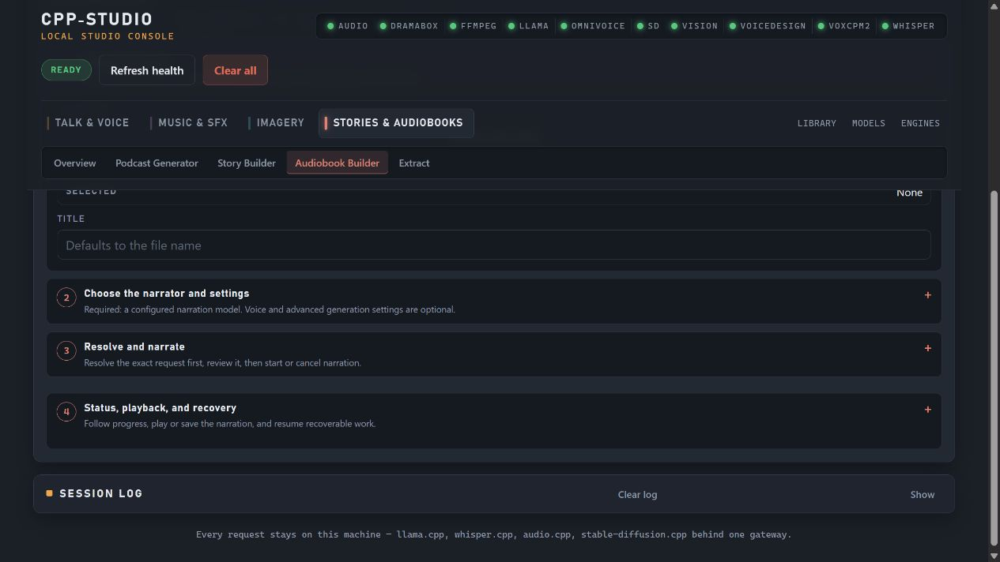
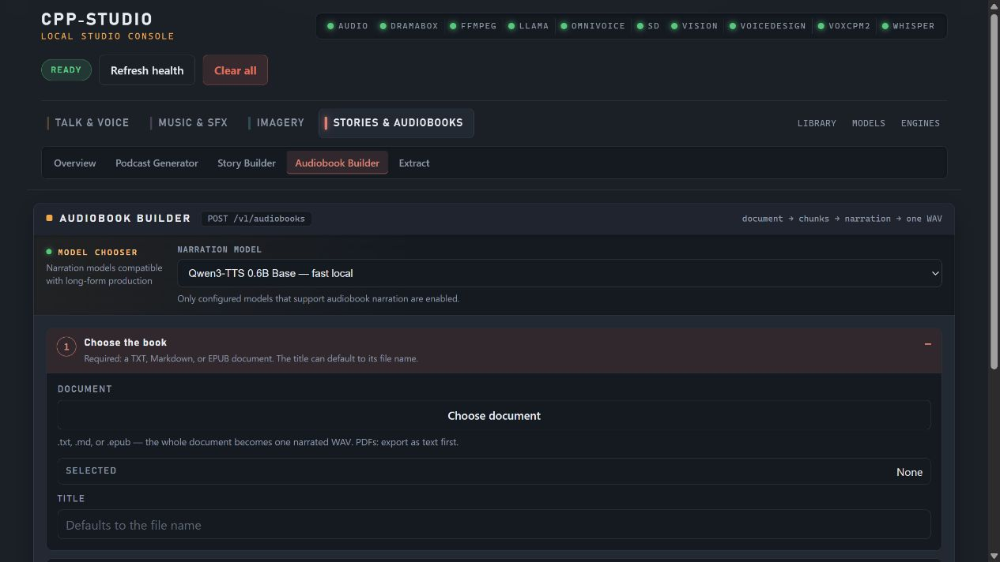
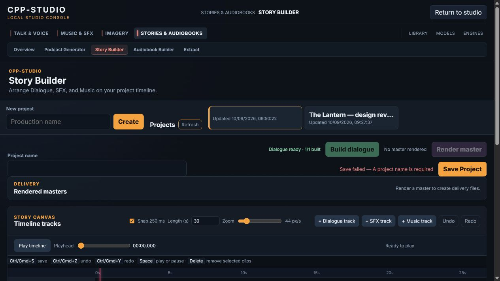

# Product flow audit: cpp-studio

**Current status:** See the [implementation and verification matrix](astra-design-implementation-20260910.md). It supersedes the intermediate implementation/test notices below and identifies the remaining browser-evidence limits.

Date: 2026-09-10. Reviewer: Astra High. This follows the design critique in `astra-design-critique-20260910.md`. Scope: completing a voice task, finding its saved output, and preserving work while changing context. Accessibility is excluded at the user's request.

The current-run in-app Browser captures below were made by the coordinating reviewer and inspected from their saved files by this reviewer. Source inspection corroborates the visible issues and identifies two work-preservation defects. No native inference, GPU service change, or human audio-quality assessment is part of this audit. Fixture generation establishes the interaction path, not native model quality. Product Design context preflight found no saved context.

## Flow and evidence

1. **Generate and save a designed Actor Voice — functional, weak completion feedback.** The coordinating reviewer generated a voice and saved it as Lantern narrator. The captured post-save state clears the voice name, retains the audition, and offers the same save action without confirming success. The following Library step proves persistence. See PA-01.

   

2. **Find the saved voice in Library — functional, incorrect date.** The saved Actor Voice has preview, reference download, owning-tool navigation, and deletion actions. Its date displays as `31/12/1, 23:58:45`. The coordinating reviewer checked that `/v1/voices` returned its actual `created_at` as `2026-09-10T08:28:42.799Z`. See PA-02.

   

3. **Run the voice loop and review output — completion is hidden.** The coordinating reviewer completed the fixture request, observed the input clear, then had to open Step 4 to see the transcript and reply. This confirms DC-01 from the preceding critique; it is not a second implementation item here.

   

4. **Edit a Story Builder project and change context — source-confirmed save gap.** The screenshot establishes the editable project, Saved state, project switcher, Refresh, Create, and Return to studio controls. Source shows that a context change can replace or abandon pending edits. This screenshot does not itself reproduce that timing condition; PA-03 requires a focused regression and transition verification.

   

5. **Reset the main Studio page — reproduced loss of a disposable draft without confirmation.** The coordinating reviewer entered “Disposable audit draft — not saved”, clicked the header “Clear all” action, and observed an immediate reset with no confirmation. The paired captures show the draft then the empty field. Browser-local extracted/training clips share that reload boundary by source and domain contract; those media clips were not separately reset in this run. PA-04 specifies the scope and cancel behavior. The captures include model selectors still checking availability, so they are accepted solely as evidence of the stable message field and reset action, not model readiness.

   

   

## Actionable findings

### PA-01 — Confirm that a designed voice was saved (P2)

**Evidence:** Step 1, `08-voice-saved-before.png`; persistence confirmed by Step 2.

**Root cause:** `internal/demo/static/app.js`, `saveDesign()` around lines 3459–3489, reports success only through `log()`, whose Session log is collapsed in the capture. The function then clears `designNameInput` and refreshes voice selectors. No success message is rendered beside the save action. The unchanged enabled action and blank name can suggest that saving failed or still needs doing.

**Smallest fix:** Show a persistent, in-place success message containing the returned voice name and an existing route to Library/voice setup. Keep audition and download available. Clear or replace that message when generating a new candidate or when a subsequent operation fails; do not hide a successful save merely because the selector refresh finishes.

**Acceptance:** Save Lantern narrator once; a visible message identifies the saved voice without opening Session log. Following the offered existing route reveals it. Failure stays visibly distinct from success, and generating another candidate removes the old confirmation. No new store or saved-voice workflow is required.

### PA-02 — Use the creation date when an update date is absent (P2)

**Evidence:** Step 2, `09-library-voice-before.png`, and the coordinating reviewer's current `/v1/voices` response.

**Root cause:** `internal/library/readmodel.go:50–51` defines `UpdatedAt` as `time.Time` with `omitempty`; its zero value can still serialize as `0001-01-01T00:00:00Z`. `actorVoiceEntry()` populates `CreatedAt` but not `UpdatedAt`. `renderLibraryEntry()` in `internal/demo/static/app.js:9635` prefers the truthy zero-date string through `entry.updated_at || entry.created_at`, producing the year-one local date. Other Library kinds without an update timestamp share this rendering path.

**Smallest fix:** Treat an absent, invalid, or serialized zero update timestamp as unavailable and fall back to a valid creation timestamp in the existing shared Library renderer. Omit the date if neither is meaningful. Preserve a real update date when provided. Do not invent a timestamp or change the owning stores.

**Acceptance:** A newly saved Actor Voice displays its actual creation date. Entries with a real update date still display that date. Missing, zero, and invalid timestamps never render year one or “Invalid Date”. Cover the shared date-selection behavior with a small focused check.

### PA-03 — Finish saving before replacing the current Story Builder context (P1)

**Evidence:** Step 4 provides current-run visual context; the loss paths are established by current source. Browser timing reproduction remains a verification task, not a claim of this screenshot.

**Root cause:** `createEditSession.scheduleAutosave()` in `story-builder.js:178–182` delays saving by 600 ms. `openProject()` at line 1575 clears that timer and loads another project without saving the current one. `refreshProjects()` at line 1559 replaces the project list from the server, discarding the dirty object. The new-project submit handler around line 2101 opens the created project without finishing the old project's save. The file has no unload guard for dirty or in-flight work. Reconciliation is built around current project identity, so simply starting a save and immediately switching is insufficient when edits occur during an active save.

**Smallest fix:** Use the existing save path to finish all pending edits before open, refresh, or create replaces the current project. Proceed only after the current project's save state is Saved; on validation, HTTP, or conflict failure, keep its edits and show the existing failure state. Protect page departure while dirty/saving, including the existing navigation to Studio; a small unload guard is sufficient for browser close/reload, while in-app navigation can await the same save path. Avoid a second persistence layer or automatic conflict overwrite.

**Acceptance:** Edit a project and immediately switch projects, refresh the list, create another project, or follow Studio navigation; reopening the original retains the edit. Cover an edit made during an in-flight save as well as the 600 ms pending timer. A failed save prevents the context replacement and leaves retryable edits visible. Reload/close while unsaved warns; a fully saved project navigates normally. Existing revision conflicts remain conflicts.

### PA-04 — Explain and confirm the page-wide reset (P1)

**Evidence:** Step 5, `11-session-draft-before.png` and `12-session-cleared-before.png`, reproduces loss of a disposable text draft with no confirmation. The “Clear all” header control also appears in Steps 1–3.

**Root cause:** `index.html:20` names the header action “Clear all”. `clearEverything()` in `app.js:5475` calls `window.location.reload()` with no scope explanation or cancel step. The domain contract explicitly makes draft/failed clean-speech clips browser-local and the exported folder their durability boundary, so a page reset can discard meaningful unexported work. Conversely, the word “all” can imply that durable Library content or server jobs will be deleted too, which the handler does not do.

**Smallest fix:** Rename the header action to describe a page/session reset and add one concise confirmation stating that unsaved inputs, results, and browser-local clips are cleared, while saved Library items and running server jobs remain. Cancel must leave the page untouched. Keep the existing reload mechanism after confirmation; do not add draft autosaving, task cancellation, or Library deletion.

**Acceptance:** Fill a disposable draft and invoke reset. The confirmation explains its actual scope; Cancel preserves draft and current tab state. Confirm resets browser-local work. A previously saved voice/project remains in Library afterward. The separate voice-loop Clear action retains its bounded behavior.

## Limits and implementation boundary

PA-01 through PA-04 are implementation requirements, reconciled with DC-01 through DC-05. The voice-loop disclosure defect is tracked only as DC-01. This audit does not request model changes, navigation redesign, new stores, or browser draft persistence. Source-confirmed save/reset behavior must be verified with focused tests and current-run browser interaction before claiming the fixes complete. Additional tool captures from the coordinating reviewer can extend the flow report without turning untouched surfaces into speculative findings.

## Follow-up captured flow

6. **Move from Podcast setup to Audiobook — destination setup is initially offscreen.** The capture reviewer scrolled within Podcast sources then clicked Audiobook in the visible navigation. The destination retained the previous scroll offset, hiding its heading and Choose document control. A manual scroll to the top revealed the expected entry point. These two current-run saved screenshots were inspected before accepting PA-05.

   

   

### PA-05 — Begin a newly selected tool at its first action (P2)

**Evidence:** Step 6, screenshots 25 and 26.

**Root cause:** `applyPage()` in `app.js` swaps visible modules and active navigation but leaves the window scroll position unchanged. The sticky header therefore conceals the new tool's earlier content when the previous page was scrolled.

**Smallest fix:** Track the displayed tool name and reset the viewport to the top only when it changes. Same-tool refresh and background result updates must not move it. Keep shared Transcribe/Extract data and edit-flush behavior intact.

**Acceptance:** Switching from scrolled Podcast sources to Audiobook shows its heading and document chooser. Reapplying the same tool or receiving a background update does not scroll. Transcribe/Extract transitions retain the shared audio and transcript.

## Implementation progress

The product reviewer implemented PA-01, PA-02, PA-04 and PA-05 in the existing main-app JavaScript, plus DC-01 result disclosure handling and DC-03 Library indicators. The same edit supplies the static action-heading CSS used by the copy reviewer's three submit-step conversions. The requested UC-01/02/04/05/06 JavaScript wording is synchronized with `astra-ux-copy-20260910.md`. Root owns PA-03 and browser verification; the copy reviewer owns main-page HTML.

`node --test scripts/test-studio-ux.cjs` passes six focused tests executing the actual production functions: meaningful Library dates, reset cancellation/confirmation, scoped result disclosure, named save success/failure, tool-change scrolling with shared data retained, and Voice Loop start/completion disclosure. Browser visual acceptance remains separate and is coordinated by root.

## PA-06 — Restore Render master after a project operation completes (P1)

7. **Build dialogue, then render the project — a stale disabled control blocks delivery.** During current-run browser acceptance, the coordinating reviewer completed one dialogue clip: the clip became Ready and the build status became “Dialogue ready · 1/1 built”, but Render master stayed disabled. Editing/saving again refreshed and re-enabled it. Screenshot 45, inspected from disk, retains the ready-build/disabled-render state while the reviewer subsequently tests a blank project name. Its visible save-validation failure is a separate PA-03 test; the preceding live observation and focused regression establish PA-06 rather than attributing the screenshot's whole state to one cause.

   

**Root cause:** `monitorDialogueBuild()` refreshes the project and calls `renderTracks()` while the `dialogueBuild` mutation still owns the exclusion boundary. `updateRenderControls()` correctly disables rendering at that point. The monitor's `finally` releases that boundary and refreshes only Build controls, leaving Render stale. Successful `revoiceCharacterVoice()` and `placeLibraryAudio()` have the same sequence: refresh the tracks while their mutation is active, then release it without refreshing render availability. Render/export completion already performs the missing refresh.

**Smallest fix implemented:** Call the existing `updateRenderControls()` after releasing the mutation in exactly these three `finally` blocks. Keep mutation exclusion, render validation and all previously saved work unchanged. No new state abstraction is needed.

**Acceptance and result:** Render remains disabled during an active operation and updates immediately after it finishes, without another edit or reload. Five new tests execute the real mutation functions and render-control function for complete/cancelled/failed dialogue builds, revoicing, and Library media placement. All five failed before the three-line fix and pass afterward; the full `scripts/test-story-builder-state.cjs` file now passes 15 tests. Root owns the final browser replay.

**Spoken-text investigation:** The inline and inspector editors commit on the native `change` event. Root found that the automation's locator fill did not produce the expected edits, whereas focused keyboard editing and blur correctly triggered the project-name validation path. Source inspection did not establish a separate spoken-text defect, so no speculative text-handler change was made. Root is checking the spoken-text path with explicit focus, typing and blur.
